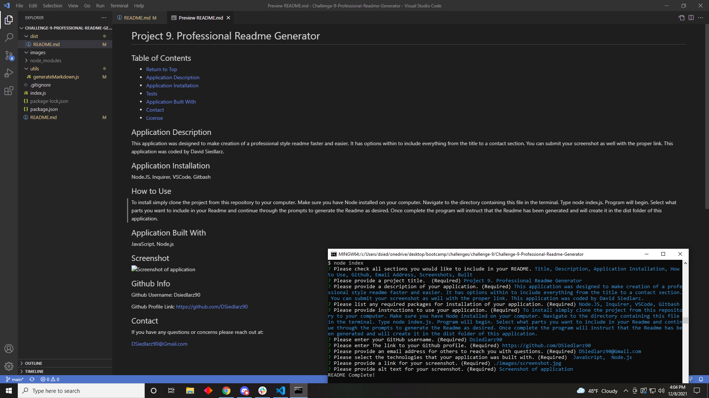

  # Project 9. Professional Readme Generator

  

  ## Table of Contents
  * [Return to Top](#)
  * [Application Description](#application-description)
  * [Application Installation](#application-installation)
  * [Tests](#tests)
  * [Application Built With](#application-built-with)
  * [Contact](#contact)
  * [License](#license)
  
  ## Application Description
  This application was designed to make creation of a professional style readme faster and easier. It has options within to include everything from the title to a contact section. You can submit your screenshot as well with the proper link. This application was coded by David Siedlarz.
  
  ## Application Installation
  Node.JS, Inquirer, VSCode, Gitbash
  
  ## How to Use
  To install simply clone the project from this repository to your computer. Make sure you have Node installed on your computer. Navigate to the directory containing this file in the terminal. Type node index.js. Program will begin. Select what parts you want to include in your Readme and continue through the prompts to generate the Readme as desired. Once complete the program will instruct that the Readme has been generated and will create it in the dist folder of this application.
  
  

  ## Application Built With
   JavaScript, Node.js
  
  ## Screenshot
  

  

  

  ## Github Info
  Github Username: Dsiedlarz90

  Github Profile Link: https://github.com/DSiedlarz90

  ## Contact
  If you have any questions or concerns please reach out at:

  [DSiedlarz90@Gmail.com](mailto:DSiedlarz90@Gmail.com)

  
  
  